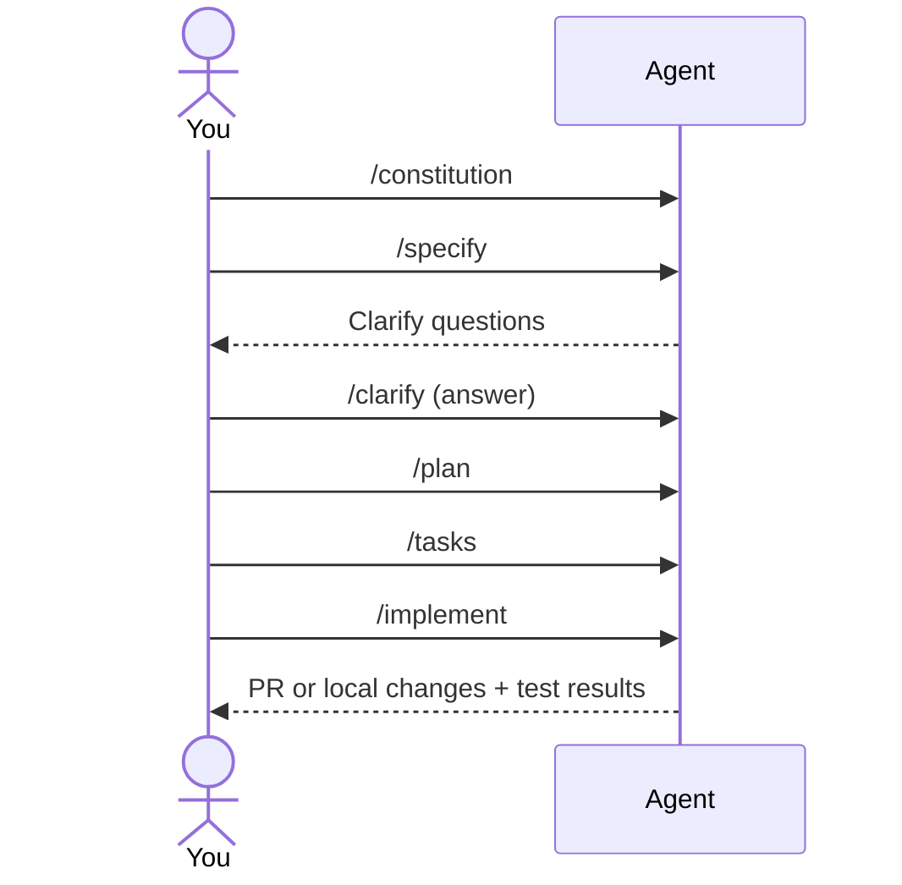

# 2 — Working with Spec Kit

Spec Kit gives you structured slash‑commands in your coding agent. The golden path:

1. `/constitution` → define non‑negotiables.
2. `/specify` → capture the what/why and acceptance criteria.
3. `/clarify` → force gap‑closing Q&A before planning.
4. `/plan` → lock in tech choices, architecture, sequencing.
5. `/tasks` → derive an executable task list.
6. `/implement` → execute tasks; iterate with reviews and tests.



## Practical tips
- Keep **spec** tech‑agnostic. Move tech choices to the **plan**.
- Always run **/clarify** once. It reduces rework.
- Guide the agent to **small PRs** and explicit **test steps**.

---

## Project Starters (pick one to ship a slice)

### Option A — PM Briefing Tool (from the prompt)
**Description**: Generate a sprint “PM Briefing” for GitHub or Azure DevOps.
**Core features**
- Integrations: GitHub and ADO (issues/work items, sprints).
- Automated status: blocked items, stories still in “New”, completion %.
- PM insights: actionable warnings like “5 tasks in NEW one day before sprint end.”
**Goal**: Save PM time by surfacing bottlenecks and risks.

**Kickoff commands**
```
/specify Build a PM briefing generator that summarizes the current sprint for a GitHub or ADO project: blocked items, stories stuck in NEW, completion %, and risks. Output a Markdown report and post it as a comment in the sprint tracking issue.
/plan Tech: Node 22 + TypeScript + GitHub GraphQL API + ADO REST API; rate limits respected; persistent cache via SQLite; Vitest + Playwright for e2e.
/tasks
```

### Option B — Construction Trade & Cost Tracker (from the prompt)
**Description**: Track trades (masonry, roofing) and costs for a house build.
**Core features**
- Define trades and assign contractors (Masonry → Ederer Ltd.).
- Budget input, invoices upload, and per‑trade spend.
- Reports: expenses, unpaid, remaining budgets (per trade and overall).
**Goal**: Clear visibility into contractors, costs, and budgets.

**Kickoff commands**
```
/specify Build a construction trade & cost tracker with trades, contractors, invoices, and per‑trade budgets. Generate realtime per‑trade and overall budget reports.
/plan Tech: Remix + TypeScript + SQLite (libsql) + Zod + Vitest + Playwright; file uploads stored locally; CSV export.
/tasks
```

---

## Five more fun starters (designed for excitement and teachable moments)

### Option C — MCP Permissions Auditor
**Description**: Point at an MCP server manifest and produce a **risk report** (scopes, filesystem access, network calls). Simulate “dry‑run” tool actions and score risk.
**Core features**
- Parse MCP manifest; enumerate tools and permissions.
- Dry‑run planner: show **what the agent could do**.
- Risk scoring with recommendations; generate an **approval summary** for security review.
**Goal**: Make MCP usage auditable and safe.
**Kickoff commands**
```
/specify Build an MCP Permissions Auditor that ingests an MCP server manifest and outputs a risk report with dry‑run tool invocations and recommended mitigations. Export as Markdown and JSON.
/plan Tech: Node 22 + TypeScript + MCP client lib + JSON Schema validation + Vitest; no network calls during dry‑run; CLI + web UI.
/tasks
```

### Option D — Release Radar DJ
**Description**: Watch your starred GitHub repos and compose **human‑quality release notes** with highlights, breaking changes, and upgrade steps.
**Core features**
- Poll releases and changelogs.
- Summarize diffs by labels (“breaking”, “security”).
- Weekly digest to a Markdown page and RSS.
**Goal**: Turn noisy feeds into actionable updates.
**Kickoff commands**
```
/specify Build a Release Radar that tracks new releases in my starred repos and generates a weekly digest with summaries and upgrade tips. Provide RSS + Markdown.
/plan Tech: Deno or Node + GitHub REST API + cron scheduler + SQLite; content signer to prevent duplication; tests for parsers.
/tasks
```

### Option E — Incident Timeliner
**Description**: Create a forensic timeline from GitHub PRs, issues, CI, and Slack export to support **post‑mortems**.
**Core features**
- Ingest PRs, test failures, deployments, and chat messages.
- Auto‑thread events; detect inflection points and regressions.
- Export a single timeline with **who/what/when**.
**Goal**: Cut post‑mortem prep from hours to minutes.
**Kickoff commands**
```
/specify Build an Incident Timeliner that correlates GitHub, CI, and Slack export data to generate a single timeline for post‑mortems. Include root‑cause hints and follow‑ups.
/plan Tech: Python + uv + Pandas + SQLite; importers per source; Jinja2 templates for HTML timeline; pytest for parsers.
/tasks
```

### Option F — Second‑Brain Sweeper
**Description**: Sweep your codebases and notes for **entropy**: stale docs, TODOs > N days, orphan branches, dead links. File fix‑it issues.
**Core features**
- Repo walkers: detect stale READMEs, 404 links, TODO age.
- Branch hygiene: flag stale branches; suggest deletes.
- Autofixers (opt‑in): PR link‑fixes and doc refresh stubs.
**Goal**: Keep knowledge bases fresh with minimal toil.
**Kickoff commands**
```
/specify Build a Second‑Brain Sweeper that scans repos for stale docs, old TODOs, dead links, and orphan branches; files issues or PRs with fixes.
/plan Tech: Node + TypeScript + GitHub REST/GraphQL + Markdown link checker; Vitest; dry‑run mode by default.
/tasks
```

### Option G — Edge Latency Heatmap
**Description**: Collect latency probes from multiple regions and graph a **live heatmap** for your edge functions or CDN.
**Core features**
- Probe scheduler; per‑region collectors.
- Heatmap and SLO alerts; CSV export.
- Compare two deployments (before/after change).
**Goal**: Understand real user latency and drift.
**Kickoff commands**
```
/specify Build an Edge Latency Heatmap that probes endpoints from multiple regions and visualizes latency distribution against SLOs, with compare mode.
/plan Tech: Cloudflare Workers + Durable Objects + D1 (SQLite) + Hono; client charting with Canvas; tests with Miniflare + Vitest.
/tasks
```

---

## Operating the loop well
- Keep specs short but **complete**; push tech to the plan.
- Prefer **idempotent** tasks with clear assertions.
- Use **ADRs** to freeze decisions and rationale.
- Regenerate tasks when the plan changes; never “drift.”

Proceed to `3_cheatsheet.md` and `4_exercises.md`.
