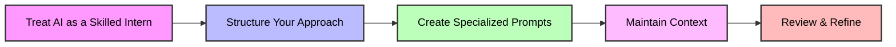
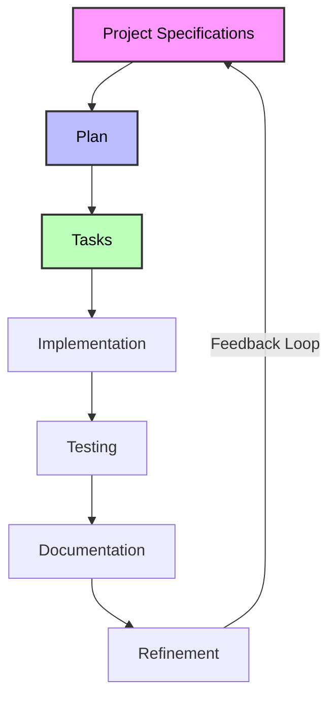

# Advanced Copilot Workshop 2025 - Spec Driven Development

## Quick Start Guide

### Key Takeaways
- **Mental Model**: Think of AI as a skilled intern who needs proper guidance, not a mind reader or a coding wizard
- **Project Structure**: Use text-based hierarchical project management (specifications → user stories → tasks)
- **Context Preservation**: Store prompts and project docs in version control for reuse and sharing
- **Specialized Templates**: Create dedicated prompts for different development scenarios (new features, refactoring, bug fixes)
- **Progressive Refinement**: Continuously improve your templates and process based on what works best

## Introduction and Planning Approach

---

## The Schrödinger's AI Paradox

The biggest mistake developers make is falling into the **Schrödinger's AI Paradox**: simultaneously believing AI is too limited for serious development work, yet expecting it to implement impossibly complex systems.

### Common Ineffective Approaches

❌ *"Implement a new award-winning game!"*

❌ *"Implement a new feature even I don't understand. Please read these 200 pages of documentation to figure it out."*

Even if you get lucky with good results, you'll immediately face these problems:

- 🥺 The AI loses context in the next session
- 🥺 The work isn't easily shareable with colleagues

**Ask yourself:** Would you give the same task to a new intern? Probably not!

---

## The Intern Analogy

Think of AI tools like GitHub Copilot or Cursor as skilled interns who need proper guidance:

### Effective Intern Onboarding

1. **Code familiarization** - Intern taking notes
2. **Project management introduction**
3. **Creating well-specified plans and tasks**

### Why Human Best Practices Work with AI

- **Onboarding** forces you to develop a comprehensive overview
- **Project management** helps track progress effectively
- **Well-specified items** lead to consistently better results

### Context Engineering

The only thing you can do to change the output of an LLM is to change what is inside its context. That's also literally the only thing that influences what it outputs -> Garbage in, garbage out

Your job is it to provide the best possible context so an LLM can do the best possible work.

---

## Communication Medium

The right communication approach with AI tools makes all the difference:

- ✅ Keep specifications as part of your repository - trackable and shareable
- ✅ AI understanding improves with better context
- ✅ Different workflows can be adapted for different use cases and team members

---

## The Solution: Minimalistic Text-Based Project Management

> **Important Note:** AI capabilities are improving rapidly, so best practices are evolving week by week!

### Basic Framework

#### 1. Generate Project Specifications / High-Level Requirements

- Define current state and/or goal state
- High level view of the project

#### 2. Generate Plans

- Features to implement
- Will change the state of specifications
- Focus on clear outcomes

#### 3. Generate Tasks

- Concrete plan on how to implement each user story
- Self-tracking capabilities
- Will update the state of user stories

**Project Flexibility:** Depending on the project size and complexity, you may need more or fewer levels in your hierarchy.

> Does this mean **I** have to write plenty of text and stuff?

No, you of course use the very AI to create those for you!

---

## Benefits of Spec-Driven Development

- 🚀 Maintains context across multiple sessions
- 🤝 Facilitates collaboration with both AI and human team members
- 📈 Produces higher quality, more maintainable code
- 📚 Gradually builds useful documentation
- 🔄 Adapts to rapidly evolving AI capabilities

---

## Challenges to Consider

- 🚀 Every team has to "find" itself - very dependent on internal requirements, constraints, philosophy
- 🤝 AI is improving week by week
- 📈 Tools are improving week by week
- 📚 Organizational overhead
- 🔄 You don't write much code anymore

→ No pre-cut best practice "That's how you HAVE TO do it" possible  
→ Learning by doing is essential

---

## Workshop Goals

In an earlier iteration we would have now started to walk through prompt templates to build ourselves a system to walk the path of the specs. Today people way smarter than me are sharing their battle-proofed templates with the world!

In this workshop we take a look at one!

[GitHub Spec Kit](https://github.com/github/spec-kit)

Jump over to Intro_to_spec-kit.md to get started

It's of course not the only template box, others exist and depending of your needs they may provide you with additional ideas making your life easier, so taking a look is worth it!

[BMAD Method](https://github.com/bmad-code-org/BMAD-METHOD)

[Vibe Kanban](https://www.vibekanban.com/)
