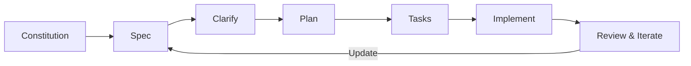

# Advanced Copilot Workshop 2025 - Spec Driven Development

> Ship faster by writing specs that generate code — and keep humans in the loop.

## What is Spec‑Driven Development (SDD)?
Spec‑Driven Development puts **a living specification** at the center of your workflow. You describe **what** should exist and **why**, then derive a **plan**, **tasks**, and **tests**. AI coding agents execute the plan, but the spec remains the single source of truth. As the system evolves, you update the spec and regenerate plans/tasks — not the other way around.

GitHub definition
>Spec-Driven Development flips the script on traditional software development. For decades, code has been king — specifications were just scaffolding we built and discarded once the "real work" of coding began. Spec-Driven Development changes this: specifications become executable, directly generating working implementations rather than just guiding them.

### Why now
- AI coding agents can implement multi‑step work, but they do best when the **context is explicit and structured**.
- Specs enable repeatability across agents, repos, and contributors.
- Versioned specs improve collaboration, code quality, and onboarding.

### Core concepts
- **Constitution**: Non‑negotiable project principles (quality bars, testing standards, UI/UX rules).
- **Spec**: Goals, scope, user stories, constraints, acceptance criteria.
- **Clarifications**: Targeted Q&A to close gaps before planning.
- **Plan**: Tech choices, architecture, sequencing, risks.
- **Tasks**: Actionable steps, dependencies, and test hooks.
- **Implementation loop**: Agents use the plan/tasks to build, test, and iterate; humans review.

### Mental model: “Skilled intern, not sorcerer”
Treat your agent like a capable intern: give it crisp goals, constraints, and review cycles. Context is the only dial you can turn. Better context → better output.

### What you should know (fast refresher)
- **ADRs (Architecture Decision Records)** to document tradeoffs and keep a decision log.
- **OpenAPI / JSON Schema / AsyncAPI** to spec machine‑readable interfaces that drive codegen, tests, and docs.
- **MCP (Model Context Protocol)** to securely wire agents to tools and data with auditable permissions.
- **Spec‑first planning** vs “vibe coding” — separate “what” (spec) from “how” (plan).

### Antipatterns to avoid
- One giant prompt that mixes goals, tech picks, and tasks.
- Skipping clarifications — uncertainty compounds.
- Changing the spec mid‑implementation without updating the plan/tasks.

## Workshop format
1. **Install & bootstrap** the toolkit that operationalizes SDD.
2. **Practice the loop**: constitution → spec → clarify → plan → tasks → implement.
3. **Run project starters**: you’ll pick one and ship a minimal, working slice.
4. **Harden** with ADRs, tests, and guardrails.

---

## Further reading
- GitHub’s **Spec Kit** (open source) — CLI + agent slash‑commands for SDD
- ADR primers and process guides
- OpenAPI quickstarts and tutorials
- MCP overviews (and security notes)

See `5_resources.md` for the curated list.
